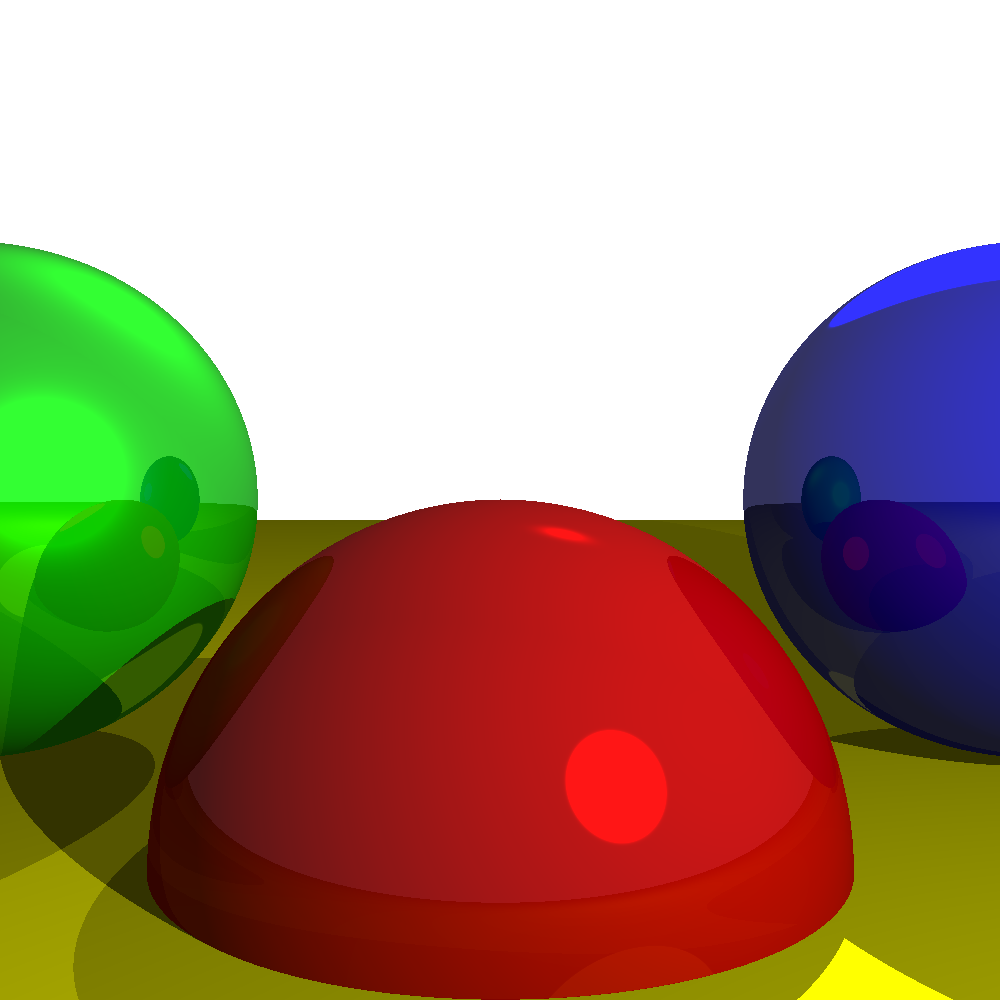

# Light Reflections

This repository contains a simple implementation of a ray tracing algorithm in Python. The program generates a 3D-rendered scene with spheres, a cylinder, and a Stanford Rabbit (loaded from an OBJ file) with specular reflections, then saves the output as an image.

## Prerequisites

Ensure you have Python 3 installed on your system along with the following libraries:

- NumPy
- Pillow

### Installing Dependencies

You can install the required dependencies using pip:

```bash
pip install numpy pillow
```

## How to Run

1. Clone this repository to your local machine:

   ```bash
   git clone https://github.com/Ali100i/LightReflections.git
   cd LightReflections
   ```

2. Run the script:

   ```bash
   python Light_reflections.py
   ```

3. After running, the script will generate an image file named `raytraced_scene.png` in the same directory.

## Customization

You can modify the scene by editing the objects and lights defined in the `render_scene` function within the `Light_reflections.py` file.

### Spheres

Each sphere is defined by:
- **Center**: The position of the sphere in 3D space.
- **Radius**: The size of the sphere.
- **Color**: The RGB color of the sphere.
- **Specular**: The specular coefficient (shininess).
- **Reflective**: The reflection coefficient (a value between 0 and 1).

Example:
```python
spheres = [
    Sphere(Vector3(0, -1, 3), 1, (255, 0, 0), 500, 0.09),  # Red sphere
    Sphere(Vector3(2, 0, 4), 1, (0, 0, 255), 500, 0.2),     # Blue sphere
    Sphere(Vector3(-2, 0, 4), 1, (0, 255, 0), 10, 0.2),     # Green sphere
    Sphere(Vector3(0, -5001, 0), 5000, (255, 255, 0), 1000, 0)  # Yellow sphere (ground)
]
```

### Lights

Lights are defined by:
- **type**: `ambient`, `point`, or `directional`.
- **intensity**: A float value specifying the light's intensity.
- **position**: The position of the light (for point lights).
- **direction**: The direction of the light (for directional lights).

Example:
```python
lights = [
    Light("ambient", 0.2),
    Light("point", 0.6, position=Vector3(2, 1, 0)),
    Light("directional", 0.2, direction=Vector3(1, 4, 4))
]
```

### Stanford Rabbit (OBJ Model)

The Stanford Rabbit is loaded from the `stanford_rabbit.obj` file using an OBJ loader function. Its position is controlled by an offset—in this project, the bunny is positioned to the left of the green sphere and one unit closer to the camera than the sphere. You can adjust the offset and scale in the `load_obj` function call within `render_scene()`.

## Output

The program renders a scene that includes spheres, a cylinder, and the Stanford Rabbit, then saves the final image as `raytraced_scene.png`.



## License

This project is open-source. Feel free to contribute by opening issues or submitting pull requests!
