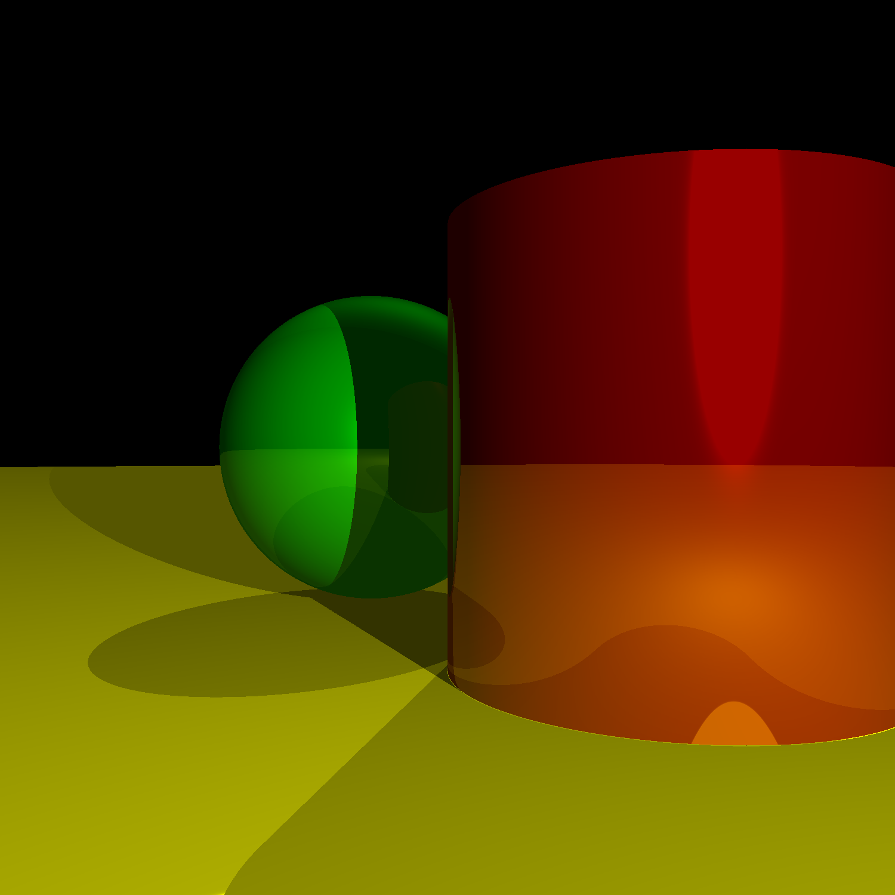

# Ray Tracing with Cylinders - InClass Challenge 1

This repository contains an implementation of a ray tracing algorithm in Python. The program generates a 3D-rendered scene that includes **spheres, cylinders, and an optional OBJ model** and saves the output as an image.

## Prerequisites

Ensure you have Python 3 installed on your system along with the following libraries:

- **NumPy**
- **Pillow**

### Installing Dependencies

You can install the required dependencies using pip:

```bash
pip install numpy pillow
```

## How to Run

1. Clone this repository to your local machine:

   ```bash
   git clone https://github.com/Ali100i/ICS_415.git
   cd ICS_415/InClass_Challenge_1
   ```

2. Run the script:

   ```bash
   python RayTracer.py
   ```

3. After running, the script will generate an image file named `raytraced_scene.png` in the same directory.

## Customization

You can modify the scene by editing the objects and lights defined in the `render_scene` function within the `RayTracer.py` file.

### Spheres

Each sphere is defined by:
- **Center**: The position of the sphere in 3D space.
- **Radius**: The size of the sphere.
- **Color**: The RGB color of the sphere.
- **Specular**: The specular coefficient (shininess).
- **Reflective**: The reflection coefficient (a value between 0 and 1).

Example:
```python
spheres = [
    Sphere(Vector3(0, -1, 3), 1, (255, 0, 0), 500, 0.09),  # Red sphere
    Sphere(Vector3(2, 0, 4), 1, (0, 0, 255), 500, 0.2),     # Blue sphere
    Sphere(Vector3(-2, 0, 4), 1, (0, 255, 0), 10, 0.2),     # Green sphere
    Sphere(Vector3(0, -5001, 0), 5000, (255, 255, 0), 1000, 0)  # Yellow sphere (ground)
]
```

### Cylinders

Cylinders are a new feature in this implementation. They are defined by:
- **Center**: The position of the cylinder in 3D space.
- **Radius**: The base radius of the cylinder.
- **Height**: The total height of the cylinder.
- **Color**: The RGB color of the cylinder.
- **Specular**: The shininess of the surface.
- **Reflective**: The reflection coefficient.

Example:
```python
cylinders = [
    Cylinder(Vector3(1, 0, 4), 1, 2, (255, 0, 0), 60, 0.4)  # Red cylinder
]
```

### Lights

Lights are defined by:
- **type**: `ambient`, `point`, or `directional`.
- **intensity**: A float value specifying the light's intensity.
- **position**: The position of the light (for point lights).
- **direction**: The direction of the light (for directional lights).

Example:
```python
lights = [
    Light("ambient", 0.2),
    Light("point", 0.6, position=Vector3(2, 1, 0)),
    Light("directional", 0.2, direction=Vector3(1, 4, 4))
]
```

## Output

The program renders a scene with spheres, cylinders, and an optional OBJ model, then saves the final image as `raytraced_scene.png`.



## License

This project is open-source. Feel free to contribute by opening issues or submitting pull requests!
