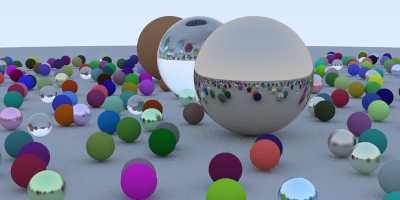

# Ray Tracer - Project 1

This repository contains an implementation of a ray tracing algorithm in Python. The program generates a 3D-rendered scene with multiple spheres and materials (lambertian, metal, and dielectric) and saves the output as an image.

## Prerequisites

Ensure you have Python 3 installed on your system along with the following libraries:

- **Pillow**

## Installing Dependencies

You can install the required dependencies using pip:

```markdown
```bash
pip install pillow

## How to Run

1. Clone this repository to your local machine:

   ```markdown
   ```bash
   git clone https://github.com/Ali100i/ICS_415.git
   cd ICS_415/Project_1

2. Run the script:

```markdown
```bash
python RayTracer.py


3. After running, the script will generate an image file named `final_scene.png` in the same directory.

## Customization

You can modify the scene by editing the objects and materials defined in the `main` function within the `RayTracer.py` file.

### Spheres

Each sphere is defined by:

- **Center**: The position of the sphere in 3D space.
- **Radius**: The size of the sphere.
- **Material**: The material of the sphere (lambertian, metal, or dielectric).

Example:

```markdown
```python
world.add(Sphere(Point3(0, 1, 0), 1.0, Dielectric(1.5)))  # Glass sphere
world.add(Sphere(Point3(-4, 1, 0), 1.0, Lambertian(Color(0.4, 0.2, 0.1))))  # Matte sphere
world.add(Sphere(Point3(4, 1, 0), 1.0, Metal(Color(0.7, 0.6, 0.5), 0.0)))  # Metallic sphere

### Materials

There are three types of materials:

- **Lambertian (diffuse material)**  
  Defined by an albedo color.

  ```markdown
  ```python
  material = Lambertian(Color(0.8, 0.3, 0.3))

- **Metal (reflective material)**  
Defined by an albedo color and a fuzziness factor (controls blurriness of reflections).

```markdown
```python
material = Metal(Color(0.8, 0.8, 0.8), 0.3)

- **Dielectric (transparent material, like glass)**  
Defined by a refractive index.

```markdown
```python
material = Dielectric(1.5)  # Glass-like material

### Camera

The camera parameters control the viewpoint and field of view.

- **Look-from**: Position of the camera.
- **Look-at**: Point where the camera is looking.
- **Field of View (FOV)**: Vertical FOV in degrees.
- **Focus Distance**: Distance for depth of field effects.
- **Aperture**: Controls depth of field (0 for sharp focus).

Example:

```markdown
```python
lookfrom = Point3(13, 2, 3)
lookat = Point3(0, 0, 0)
vup = Vector3(0, 1, 0)
vfov = 20
focus_dist = 10.0
aperture = 0.0
camera = Camera(lookfrom, lookat, vup, vfov, aspect_ratio, aperture, focus_dist)

## Output

The program renders a scene with randomly distributed spheres of different materials and saves the final image as `final_scene.png`.

```markdown

