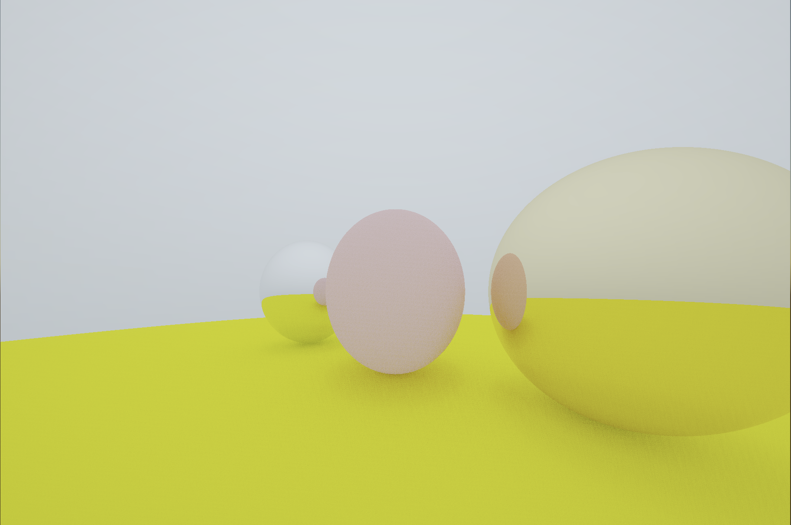

# Raytraced rolling metalic balls 

This repository contains a custom shader for Unity that simulates raytraced rolling metallic balls. The shader uses raytracing techniques to generate realistic reflections and dynamic, time-based animations. It is inspired by a Shadertoy implementation and includes environment mapping so that an external image is reflected on the metallic surfaces.

## Features

- **Raytraced Reflections:** Realistic reflections on metallic balls.
- **Rolling Metallic Balls:** Animated spheres that roll and change over time.
- **Environment Mapping:** An environment texture is used for reflections.
- **Time-based Animation:** Dynamic scene changes controlled by shader time.
- **Customizable Parameters:** Easily adjust texture, resolution, and animation speed.

## Prerequisites

- **Unity:** Version 2019.4 LTS or later is recommended.
- **Basic Knowledge:** Familiarity with Unity’s material system and shader workflows.

## Installation

1. **Clone or Download the Repository:**

   ```bash
   git clone https://github.com/your_username/ICS_415.git
   ```
2. **Import into Unity**
   
  - Open your Unity project or create a new one.
  - Drag the Project_2 folder from the repository into your project's Assets folder.

## Usage

1. **Create a Material:**

  - In the Unity Editor, right-click in the Project window and choose Create > Material.
  - Name the new material (e.g., RollingMetallicBallsMaterial).
    
2. **Assign the Shader:**

  - With the material selected, open the Inspector.
  - In the Shader dropdown, navigate to the custom shader in the Project_2 folder and select it.
    
3. **Configure Shader Properties:**

  - _MainTex: Assign your desired environment texture. This texture will be used both as the background and for the reflections on the metallic balls.
  - _Resolution: Set this to match your desired resolution (e.g., (1920,1080,0,0)).
    
4. **Apply the Material:**

- Drag the material onto a GameObject (for example, a Quad) in your scene.
- Ensure your scene camera is configured correctly (e.g., aspect ratio settings).
  
5. **Run the Scene:**

  - Press Play in Unity to view the shader in action.
  - You should see rolling metallic balls with realistic reflections of the environment texture.

## Output 

Below is an example of the rendered scene:



## License

This project is open-source. Feel free to contribute by opening issues or submitting pull requests!
